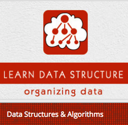

```
Roberto Nogueira  
BSd EE, MSd CE
Solution Integrator Experienced - Certified by Ericsson
```
# Tutorialspoint Sata Structures and Algorithms



**About This Tutorial**

This is to grasp rapidly the language and its concepts.

[C++ Tutorial](https://https://www.tutorialspoint.com/data_structures_algorithms/index.htm)

#### Topics
```
C++ Basics
[ ] C++ Home
[ ] C++ Overview
[ ] C++ Environment Setup
[ ] C++ Basic Syntax
[ ] C++ Comments
[ ] C++ Data Types
[ ] C++ Variable Types
[ ] C++ Variable Scope
[ ] C++ Constants/Literals
[ ] C++ Modifier Types
[ ] C++ Storage Classes
[ ] C++ Operators
[ ] C++ Loop Types
[ ] C++ Decision Making
[ ] C++ Functions
[ ] C++ Numbers
[ ] C++ Arrays
[ ] C++ Strings
[ ] C++ Pointers
[ ] C++ References
[ ] C++ Date & Time
[ ] C++ Basic Input/Output
[ ] C++ Data Structures

C++ Object Oriented
[ ] C++ Classes & Objects
[ ] C++ Inheritance
[ ] C++ Overloading
[ ] C++ Polymorphism
[ ] C++ Abstraction
[ ] C++ Encapsulation
[ ] C++ Interfaces

C++ Advanced
[ ] C++ Files and Streams
[ ] C++ Exception Handling
[ ] C++ Dynamic Memory
[ ] C++ Namespaces
[ ] C++ Templates
[ ] C++ Preprocessor
[ ] C++ Signal Handling
[ ] C++ Multithreading
[ ] C++ Web Programming

C++ Useful Resources
[ ] C++ Questions and Answers
[ ] C++ Quick Guide
[ ] C++ Object Oriented
[ ] C++ STL Tutorial
[ ] C++ Standard Library
[ ] C++ Useful Resources
[ ] C++ Discussion

Selected Reading
[ ] Developer's Best Practices
[ ] Questions and Answers
[ ] Effective Resume Writing
[ ] HR Interview Questions
[ ] Computer Glossary
[ ] Who is Who 
```

